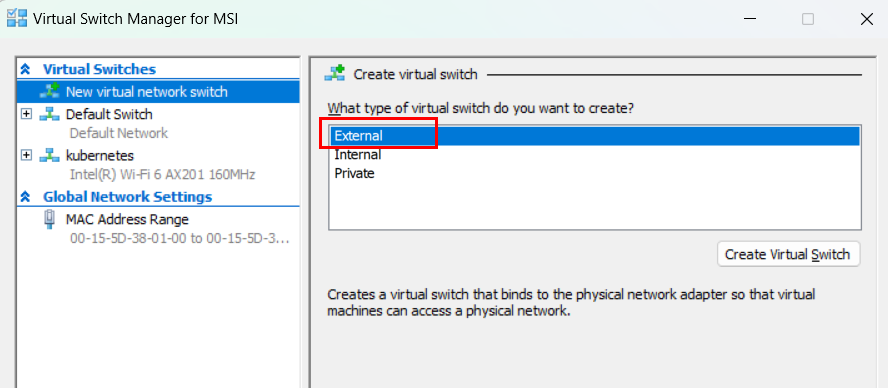

## Set-Up Hyper-V VM's

Create Virtual Switch




> [!NOTE]
> While using Hyper-v with Vagrant, you need admin priviliges, run powershell or VSCode as administrator.

Bring up machines.

```
vagrant up 
```

> [!NOTE]
> Vagrant will ask you which virtual switch to use. You can avoid it adding network setting for switch **"config.vm.network "public_network", bridge: "kubernetes"** into Vagrantfile.

> [!NOTE]
> Vagrant has limitations for networking settings in Hyper-v (Please see [Vagrant official document](https://developer.hashicorp.com/vagrant/docs/providers/hyperv/limitations)). 

> [!NOTE]
> We need static ip for our nodes, you can use DHCP reservation. Do do that, you need current MAC address and IP of VM.  

Get MAC address


Get IP address running following Generate-HostsFile.ps1

```shell
Generate-HostsFile.ps1
```

Setting address reservation is similar on each modem/router. See the example below.


> [!NOTE]
> I have router in my location and machines are getting ip from this router. The range is 192.168.68.0/22. You'll see different IP range in my case.

Once we have IP's we need add ip/hostname record to VM's /etc/hosts to make machines to reach each other using their hostnames. Run the Update-VMHosts.ps1 script.

```shell
Update-VMHosts.ps1
```