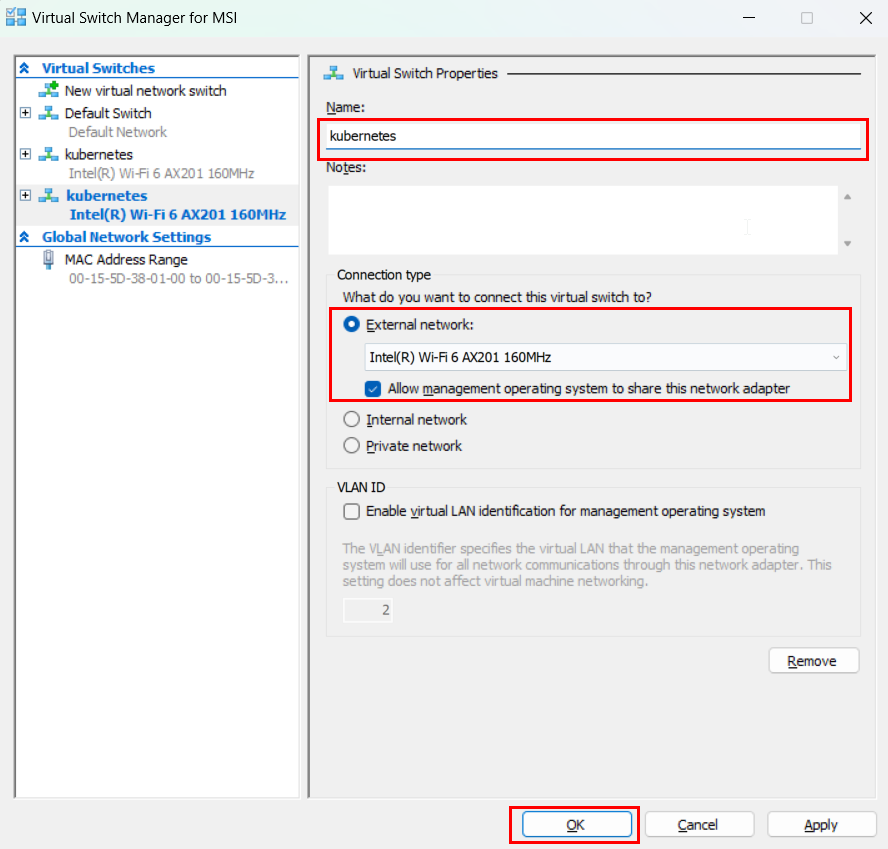
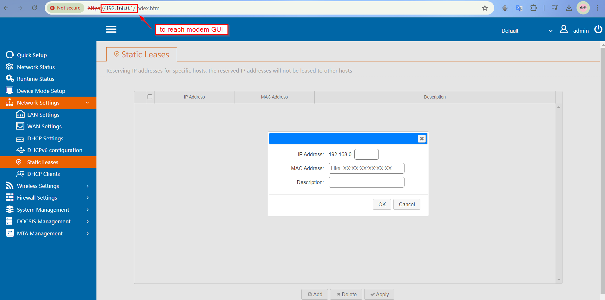

## Set-Up Hyper-V VM's

Vagrant has limitations for networking settings in Hyper-v (Please see [Vagrant official document](https://developer.hashicorp.com/vagrant/docs/providers/hyperv/limitations)). 

### Create virtual switch





### Bring up machines

> [!NOTE]
> While using Hyper-v with Vagrant, you need admin priviliges, run powershell or VSCode as administrator.

> [!NOTE]
> Vagrant will ask you which virtual switch to use. You can avoid it adding network setting for switch **"config.vm.network "public_network", bridge: "kubernetes"** into Vagrantfile.

- Run the following command in the directory where your Vagrantfile is located.

    ```
    vagrant up 
    ```

### Apply DHCP address reservation

We need static IPs for our nodes, and we can use DHCP reservations to prevent the VMs from getting different IPs after each reboot. I preferred not to set static IPs within the VMs themselves, as Vagrant might have trouble SSHing into the machines (if I'm not mistaken). To set up DHCP reservations, you'll need the current MAC addresses and IPs of the VMs. 


- Run the following script to get MAC, IP addresses with VM names.

    ```shell
    Get-Mac-Ip.ps1
    ```

- Setting address reservation is similar on each modem/router. See the example below.



> [!NOTE]
> I have router in my location and machines are getting ip from this router. The range is 192.168.68.0/22. You'll see different IP range in my case.

### Configure VMs for hostname-based communication

To enable a VM to communicate with other VMs using their hostnames, we need to add the IP addresses and hostnames of the other VMs to its /etc/hosts file. 

I'll combine both following scripts in a single script. 

- Get IP address running following Generate-HostsFile.ps1. Script will provide hosts.txt file and in this file you'll see IP addresses.

    ```shell
    Generate-HostsFile.ps1
    ```
-  Run the Update-VMHosts.ps1 script. This script will add the addresses to VM's /etc/hosts.txt

    ```shell
    Update-VMHosts.ps1
    ```

